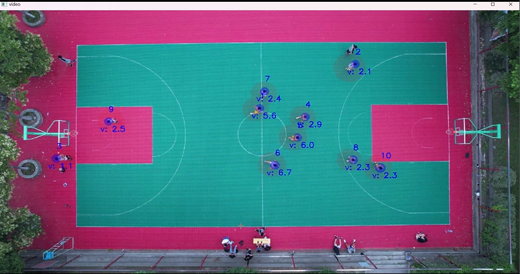
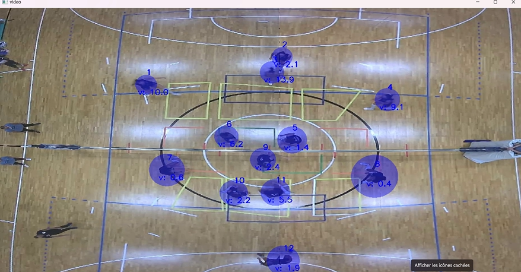

# Computer Vision on Player Tracking

This project focuses on player tracking using computer vision techniques and is a component of the Computer Vision course at the University of Trento. 

To experiment with our tool, navigate to demo_tracking.py.

<video width="630" height="300" src="https://github.com/etienne-bnd/computer_vision/blob/62d364ada157685472c8b83feedf3e71c7962ce2/demo_tracking.mp4"></video>
